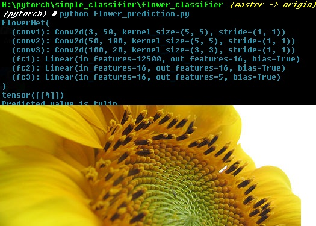

### Pytorch daily challenges 

#### Why 

1. Because of lack of comprehensive guides of how to use Pytorch on simple task this repo should be helpful. 
2. At the very early stage I decided to implement simple vonv nets classifiers to show how Pytorch behave and 
3. to learn how to deal with predictions/transforms on single images. 

Description

Repositories contain:

- data loader section
- Model Architecture section
- Model training 
- Prediction on single image

## Mnist cnns 

## Flower detection 

- Dataset 

- <a href = "https://www.kaggle.com/alxmamaev/flowers-recognition"> FLower dataset </a>

#### Results

As you can see, pretrain model which you can download from folder is not something we can be proud of. 
So you have to treat it like an real toy example as far as it was trained with only 10 epochs :)

#### Jokes generator 

Short jokes generator using RNN. 

- dataset

https://www.kaggle.com/abhinavmoudgil95/short-jokes

#### LeNEt 5

- based on MNIST dataset

- Network architecture: <a href = 'https://engmrk.com/lenet-5-a-classic-cnn-architecture/'>click</a>

### GAN 

27062019

Add GAN Implementation
